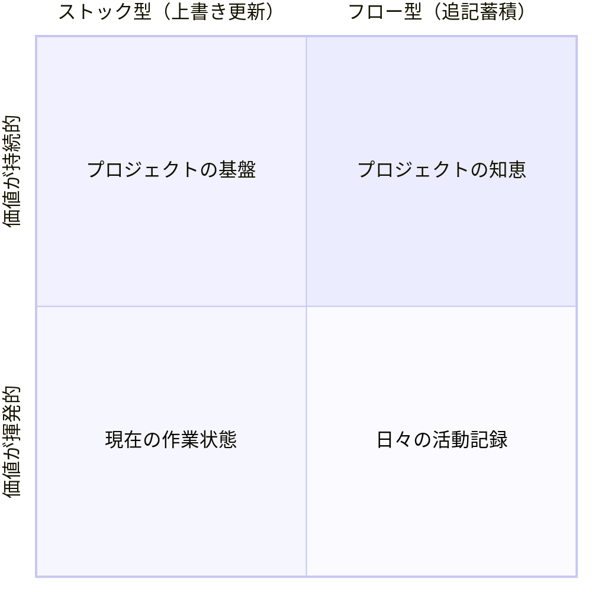

> **シリーズ記事**: Claude Codeとどう向き合うか
>
> ← 前の記事: [AIが変える開発プロセスと人間の新しい役割](./2025-06-24-claude-code-2-process-and-bottleneck)

## はじめに

前回の記事では、AIとの協働における開発プロセスの変化と、人間の作業がボトルネックになることを確認しました。効率的な協働のためには、AIを自律的に働かせる必要がありますが、そこで鍵となるのが情報管理です。

本記事では、AIエージェント時代における情報管理の新しい視点と、人間の役割の変化について考察します。

## AIとの協働における情報管理の新たな重要性

### AIを自律的に働かせるための前提条件

AIとの並列作業を実現するには、人間が常に隣で指示を出し続けることは不可能です。AIが自走するためには、**ドキュメントを通じた非同期の情報共有**が不可欠となります。

特にソフトウェア開発においては、AIが適切な判断を下すために必要な**コンテキスト**が重要です。現在のコードベースの構造、採用している設計パターン、過去の技術的決定、チームの慣習など、これらの背景情報があって初めて、AIは人間の意図に沿った実装を進めることができます。

このようなコンテキストは、Claude Codeの「[メモリ](https://docs.anthropic.com/en/docs/claude-code/memory)」機能を使って管理することが推奨されています。プロジェクト固有の情報をCLAUDE.mdファイルに記述しておくことで、AIは常にこれらの情報を参照しながら作業を進めることができます。

しかし、ここで新たな課題が生まれます。

### 情報爆発という新しい問題

AIエージェントは膨大な量の情報を生成できます。

- 詳細な作業ログ
- 実装の試行錯誤の記録
- コードの説明文書
- デバッグの過程

しかし問題は、これらすべてをメモリに書いても、AIも人間も必要な情報を見つけられなくなることです。「なぜこのライブラリを選んだんだっけ？」「このバグの回避策はどこに書いたっけ？」といった重要な情報が、大量の作業ログに埋もれて見つからない。

結果として、同じ議論を繰り返したり、過去の失敗を繰り返すことになります。

従来の「情報を書く」ことがボトルネックだった時代から、「大量に生成される情報から価値あるものを選別する」ことが課題となる時代へと変化しました。

### 求められる新しい情報管理の視点

この変化に対応するには、情報を体系的に捉える新しい枠組みが必要です。

従来、情報管理はチーム開発において不可欠なものでした。設計文書、コーディング規約、議事録など、チームメンバー間で知識を共有するための仕組みです。しかしAIエージェントの登場により、**個人がAIとチームを組む**という新しい開発スタイルが生まれました。

これにより、これまでチームレベルで行っていた情報管理を、個人レベルでも実践する必要が出てきたのです。AIというチームメイトと効率的に協働するには、すべての情報を同じように扱うのではなく、**情報の性質を理解し、適切に管理する戦略**が求められています。

## 情報を捉える2つの軸

開発における膨大な情報を整理するには、次の2つの軸で考えるとよいでしょう：

### 第1の軸：情報の更新方法

- **ストック型**：上書き更新される現在の状態
- **フロー型**：追記蓄積される過去の記録

### 第2の軸：価値の揮発性

- **揮発的**：時間とともに参照価値が下がる
- **持続的**：長期間にわたって価値を保つ

## 4象限で理解する情報の性質



### 各象限の詳細

#### プロジェクトの基盤（ストック×持続的）

- 常に最新の状態を保つ必要がある
- プロジェクトの土台となる情報
- 例：README、API仕様書、アーキテクチャ図

#### プロジェクトの知恵（フロー×持続的）

- 過去の経験から得られた貴重な知見
- 時間が経っても価値が失われない
- 例：ADR（Architectural Decision Record）、設計決定記録、重要な教訓

#### 現在の作業状態（ストック×揮発的）

- 今まさに進行中の作業に必要
- 頻繁に更新される
- 例：TODOリスト、一時的な仕様、今週の目標

#### 日々の活動記録（フロー×揮発的）

- 作業の過程で生成される詳細な記録
- その時点での具体的な状況に依存した内容
- 例：作業ログ、デバッグメモ、試行錯誤記録

## AIエージェントがもたらす変化

### 情報生成の非対称性

AIエージェントの導入により、情報管理に根本的な変化が生じています。

#### 大量生成される情報（主に揮発的）

- 詳細な作業ログを自動生成
- すべての試行錯誤を記録可能
- 膨大な量のデバッグ情報

#### 選別が必要な情報（持続的価値の発見）

- 重要な設計決定の抽出
- 再利用可能な知見の特定
- 将来の参考となる教訓

### 人間の新しい役割：価値ある情報の選別と整理

AIが生成する大量の揮発的情報から、持続的価値のある情報を見極め、整理することが人間の新しい役割となります。特に重要なのが「**フロー×持続的**」の象限です。この領域の情報（ADR、設計決定の背景、重要な教訓）は、意識的に保護しなければ失われてしまいます。

従来は情報を「書く」ことがボトルネックでしたが、現在は情報を「選別・整理」することがボトルネックになっています。

## 実践への示唆

### 情報管理の新しいマインドセット

1. **すべてを管理しようとしない**

   - 揮発的な情報は積極的に捨てる
   - 持続的価値のある情報に集中

2. **AIを活用した情報の昇華**

   - 「今週の作業ログから重要な決定を抽出して」
   - 「このデバッグ記録から再利用可能な知見をまとめて」

3. **フロー×持続的の意識的な保護**
   - Design DocやADRの作成を習慣化
   - 「なぜ」の記録を残す文化

### 情報の流れを設計する

効率的な協働のためには、情報がどう流れ、どこに蓄積されるかを意識的に設計する必要があります。2軸モデルは、この設計の指針となる枠組みです。

## CLAUDE.mdに何を書くべきか

実際にClaude Codeを使っていると、CLAUDE.mdには2つの異なるニーズが存在することに気づきます：

1. **持続的価値のある情報を保管したい**：技術スタック、設計方針、コーディング規約など、プロジェクトの基盤となる情報

2. **今この瞬間に必要な揮発的情報も共有したい**：現在のタスク、直近の実装方針など、日々のタスクを進めるために必要な情報

しかし、CLAUDE.mdに揮発的な情報を書いてしまうと問題が生じます：

- 頻繁な書き換えが必要になる
- 持続的な情報と揮発的な情報が混在し、見通しが悪くなる
- 本当に重要な設計方針が、一時的な作業メモに埋もれてしまう

このギャップにどう対処すればよいでしょうか。

### 情報の性質に応じた管理戦略

4象限モデルを使って、情報の置き場所を整理することで、この問題に対処できます：

- **CLAUDE.md**：「ストック×持続的」の基盤情報と、特に重要な「フロー×持続的」の決定事項
- **作業ディレクトリのメモ**：「ストック×揮発的」の現在の作業状態
- **過去の会話履歴**：「フロー×揮発的」の作業ログ（AIが自動的に記憶）

つまり、CLAUDE.mdを「変わらない土台」として保ちつつ、揮発的な情報は別の適切な場所で管理するという戦略です。

### ファイル参照を活用した解決策

CLAUDE.mdは他のファイルを参照できるため、これを活用した管理方法も考えられます：

```markdown
## 現在の作業状態
現在の作業状態は @docs/current-sprint.md を参照してください。
このファイルは毎週更新されます。

## 進行中のタスク
@TODO.md に最新のタスクリストを管理しています。
```

このようにCLAUDE.mdには：
- 持続的な情報を直接記載
- 揮発的な情報は**どこにあるか**と**どう更新されるか**のメタ情報のみ記載

という構成にすることで、CLAUDE.md自体は安定を保ちつつ、AIは必要な揮発的情報にもアクセスできるようになります。

これは絶対的な正解ではありませんが、情報の性質に応じた管理を実現する一つの実践的なアプローチです。

## まとめ

AIエージェントとチームを組むことで、個人でも本格的な情報管理が必要になりました。従来はチーム開発で行っていた文書化や知識共有を、AIとの協働でも実践する必要があるのです。

AIが大量の情報を生成する中で、私たちの役割は「価値ある情報の選別と整理」へと変化しています。2軸モデルを活用して情報の性質を理解し、本当に価値のある情報に集中することが、効率的な協働の鍵となります。
